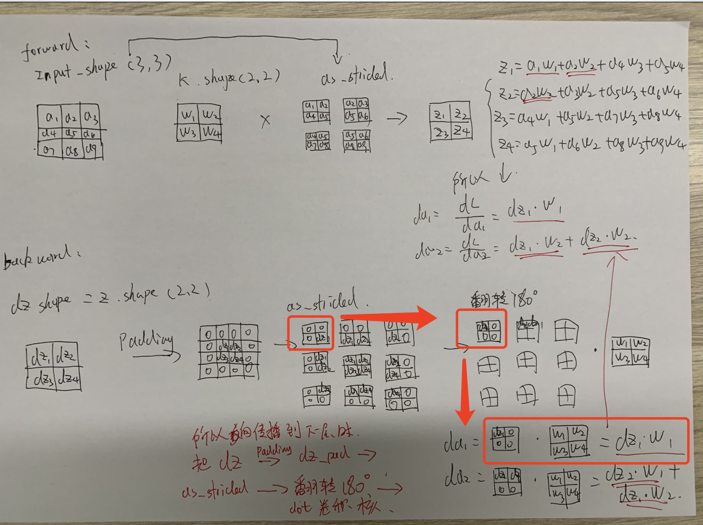

# 1 dw的计算：

"""

```python
self.dz = grad * self.activation.backward()
self.dw = np.tensordot(self.dz, self.input_split, axes=[(0, 2, 3), (0, 2, 3)]) / self.m
self.db = np.mean(self.dz, axis=(0, 2, 3))
```

"""


dw的更新这么去理解（用模型为test_cnn，数据为cifar10的最后一个cnn层来理解）

dz的shape（32，32，28，28）表示（样本数，下一层的通道数（这一轮的卷积核数），下一层的W，下一层的H）
input_split的shape(32,16,28,28,3,3)表示（样本数，通道数，（28,28)指的是下一轮的W和H，(3,3)表示卷积核大小)

np.tensordot(self.dz, self.input_split, axes=[(0,2, 3), (0, 2, 3)])表示，按照(样本数，28,28)的这个轴进行dot，并广播，得到的shape为（32,16,3,3）表示（卷积核数，通道数，卷积核大小）

具体的tensordot过程为：

1 首先对dz（:,:,28,28)维度的元素 * input(:,:,28,28)的(3,3) 每一个元素相乘 得到（32，32，16，3，3)

然后把样本数去除，那么

dz的shape为（32，28，28）

input的shape(16,28,28,3,3)

然后把每个卷积核的数量去掉，那么

dz的shape为（28，28)

在前向传播中，

input经过np的as_strided的函数分裂为(16,28,28,3,3)，指形状为(16,3,3）的卷积核与input(16,3,3）的区域对应相乘相加得到一个1个值，并且这个操作要执行(28,28)次，那么

在后向传播的时候用tensordot在28，28这个维度，让每一个dz的值都乘以input的(16,3,3)的值，并且加在一起，就是对应的梯度了。（就是前向传播的操作反一下， 把这个28*28次的操作对应的结果加在一起。

2 然后对每一个样本都执行上面的操作，相加，得到(32,16,3,3）

# 2 da的计算（反向传播到下一层的grad)

1 把dz padding

2 把dz_pad   as_splited分裂为一个view

3 把这个view下的每个小矩阵翻转180度

4 把翻转后的每个小矩阵和卷积核dot，就是da


